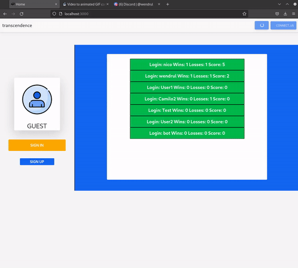

# ft_transcendence
[Surprise](https://cdn.intra.42.fr/pdf/pdf/49463/en.subject.pdf)

#  [42Daprovin](https://github.com/42daprovin) & [wendrul](https://github.com/wendrul) & [AdamGoodwin9](https://github.com/AdamGoodwin9) & [Ericfreespirit](https://github.com/Ericfreespirit) & Corozco
## -ft_transcendence(42cursus-2022//Paris)

```sh
$ Status =
	#finished
$ Note =
	#100
$ To run the development environment run:
   create .env file -> ft_transcendence/srcs/nestjs-backend
   # POSTGRES_DB_HOST=postgres
   # POSTGRES_DB_PORT=5432
   # POSTGRES_DB_USERNAME=root
   # POSTGRES_DB_PASSWORD=root
   # POSTGRES_DB_DATABASE=db
   # URL_FRONT=http://localhost:3000
   # AUTH42_CLIENTID=
   # AUTH42_CLIENTSECRET=
   # AUTH42_CLIENT_CALLBACKURL=
   # COOKIES_SECRET=1bc5825c04b9496081645f5670f28dce
   docker-compose up --build
```



